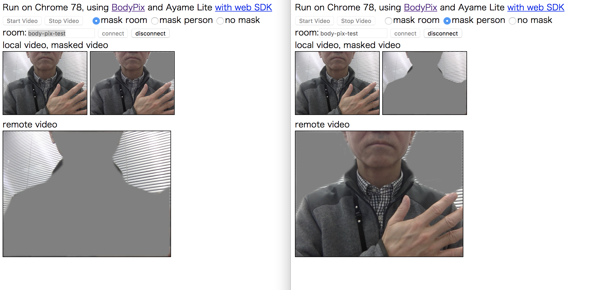

## bodypix_ayame

WebRTC P2P video conference example, with person body segmentation and mask.

人物を検出し、背景や人物をマスクして、WebRTCのP2P通信を行うサンプル。次のライブラリ、サービスを利用。

- tensorflow.js の人体検出モデル [tfjs-models/body-pix](https://github.com/tensorflow/tfjs-models/tree/master/body-pix)
- [OpenAyame/ayame-web-sdk](https://github.com/OpenAyame/ayame-web-sdk)
- [urtzurd/html-audio](https://github.com/urtzurd/html-audio) PitchShifter

### Repo / レポジトリ

- https://github.com/mganeko/bodypix_ayame

### GitHub Pages

- https://mganeko.github.io/bodypix_ayame/video_mask_ayame.html ... video mask and WebRTC P2P
- https://mganeko.github.io/bodypix_ayame/video_mask_voice_ayame.html ... video mask, voice pitch shift and WebRTC P2P
- https://mganeko.github.io/bodypix_ayame/video_mask.html ... video mask only

### Screen shot / 画面

## Hot to use / 利用方法

- start with 2 browser windows
  - open [video_mask_ayame.html](https://mganeko.github.io/bodypix_ayame/video_mask_ayame.html) with desktop Chrome 78
    - or open [video_mask_voice_ayame.html](https://mganeko.github.io/bodypix_ayame/video_mask_voice_ayame.html) for voice pitch shift
  - click [Start Video] button
    - local video will be shown in top left video
    - Plase wait few seconds to initialize BodyPix, then masked video will be shown in top right video
  - choose mask type
    - mask background surrounding a person
    - mask person
    - no mask
  - choose voice type for video_mask_voice_ayame.html
    - mute ... voice mute
    - low pitch ... low pitch voice
    - high pitch ... high pitch voice
    - normal ... normal voice
  - type room-id for Ayame Lite service
  - click [connect] button
- stop
  - click [disconnect] button
  - click [Stop Video] button

- 開始 (ブラウザの2つのウィンドウでそれぞれ実施)
  - デスクトップ Chrome 78で、 [video_mask_ayame.html](https://mganeko.github.io/bodypix_ayame/video_mask_ayame.html) を開く
    - またはボイスチェンジャー付きの [video_mask_voice_ayame.html](https://mganeko.github.io/bodypix_ayame/video_mask_voice_ayame.html) を開く
  - [Start Video] ボタンをクリック
    - 自分の映像が、左上にビデオ要素に表示
    - 数秒待つとBodyPixが初期化され、右上のビデオ要素にマスクされた映像が表示
  - マスクの種類は選択可能
    - mask background ...  人物の周囲の部屋の様子をマスク
    - mask person ... 人物をマスク
    - no mask ... マスク無し
  - video_mask_voice_ayame.htmlの場合は音声の種類を選択可能
    - mute ... 音声ミュート
    - low pitch ... 低いピッチの声
    - high pitch ... 高いピッチの声
    - normal ... 通常の声
  - Ayame Lite サービスに接続する room-id を指定
  - [connect] ボタンをクリック
- 停止
  - [disconnect] ボタンをクリック
  - [Stop Video] ボタンをクリック

## License

- Apache License 2.0

## Thanks

bodypix_ayame is using service / repogitory bellow.

bodypix_ayame は、次のレポジトリ/サービスを利用しています。ありがとうございます。

- [tensorflow/tfjs](https://github.com/tensorflow/tfjs) (Apache License 2.0)
- [tfjs-models/body-pix](https://github.com/tensorflow/tfjs-models/tree/master/body-pix)  (Apache License 2.0)
- [OpenAyame/ayame-web-sdk](https://github.com/OpenAyame/ayame-web-sdk)  (Apache License 2.0)
- [urtzurd/html-audio](https://github.com/urtzurd/html-audio) PitchShifter (MIT License)
- [WebRTC シグナリングサービス Ayame Lite](https://ayame-lite.shiguredo.jp/beta)（株式会社時雨堂）

